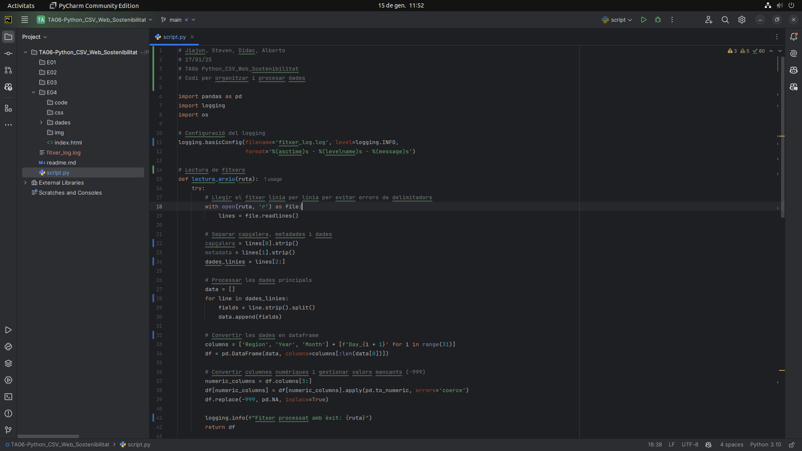
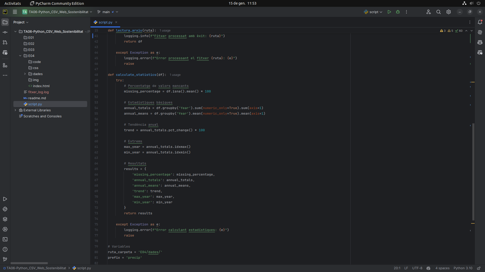
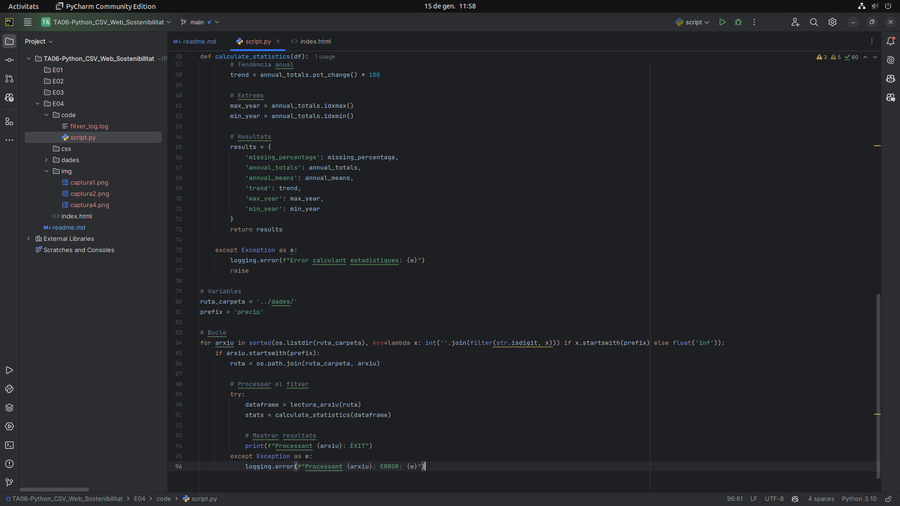
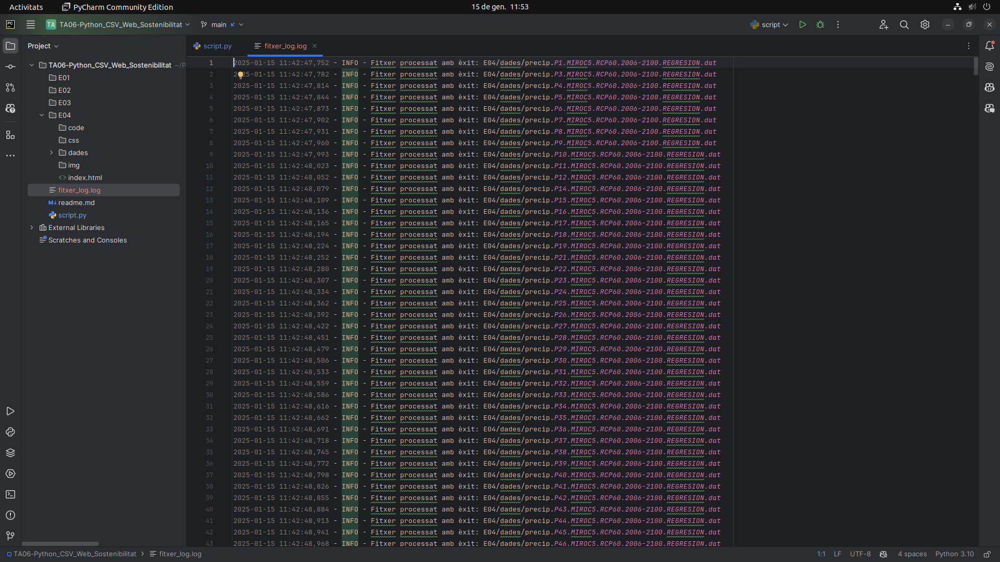

### Creació del script

#### 1. **Lectura dels fitxers**
   - Es va utilitzar `pandas` per llegir els fitxers i evitar errors de delimitadors inconsistents. Es van revisar les dues primeres files per obtenir la capçalera i les metadades.

#### 2. **Revisió de les capçaleres i tipus de dades**
   - Les dades estan delimitades per espais i les columnes són `Region`, `Year`, `Month`, i `Day_1` fins a `Day_31` i es va verificar que les columnes tinguessin els tipus de dades esperats.

#### 3. **Verificació del format dels arxius**
   - S'assegura que tots els fitxers tinguessin el mateix nombre de columnes i delimitadors.

#### 4. **Neteja de les dades**
   - Es va assegurar que les columnes tinguessin els tipus de dades correctes (numèrics per les precipitacions).
   
#### 5. **Tractament dels valors nuls**
   - Es va mantenir la integritat de les dades no eliminant files amb valors nuls, però es va calcular el percentatge de valors mancants.

#### 6. **Estadístiques calculades**
   - Es van calcular les mitjanes i totals anuals, la tendència de canvi i els anys més plujosos i més secs.

#### 7. **Estadístiques addicionals**
   - Es va calcular el percentatge de valors mancants per columna i es van identificar els anys amb més i menys precipitació.

#### 8. **Documentació del procés**
   - El procés es va documentar amb la llibreria `logging` per facilitar la reproducció i auditoria del mateix en el futur.

